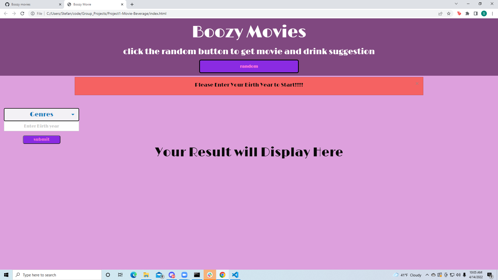

# Project1-Movie-Beverage

User Story:
As a hard working individual with the desire for some down time
I want an easy process to find a movie and drink recipe
So that I can skip the long scrolling selection process on Netflix and try a new fun beverage

GIVEN I am using Boozy Movies Website for drink and movie suggestions
WHEN I open the site
THEN the the title and instructions are placed in plain sight
WHEN I input my birth year
THEN the site either remains on the screen or redirects me to DisneyPlus depending on my age (If I can legally partake in alcohol)
WHEN I click the Random button
THEN a random movie poster, title and its genres are displayed center left and a drink picture, name and ingredients display center right
WHEN I select one or more genres in the genre drop down
AND WHEN I click submit
THEN a movie with that/those genres populates center left and a random beverage populates center right

Below You can find some screenshots of the application in (Lights, Camera,) Action!
Starting with the screen that will greet users when they open the app, you can also see what it looks like to use the random button and searches definined by genre!

